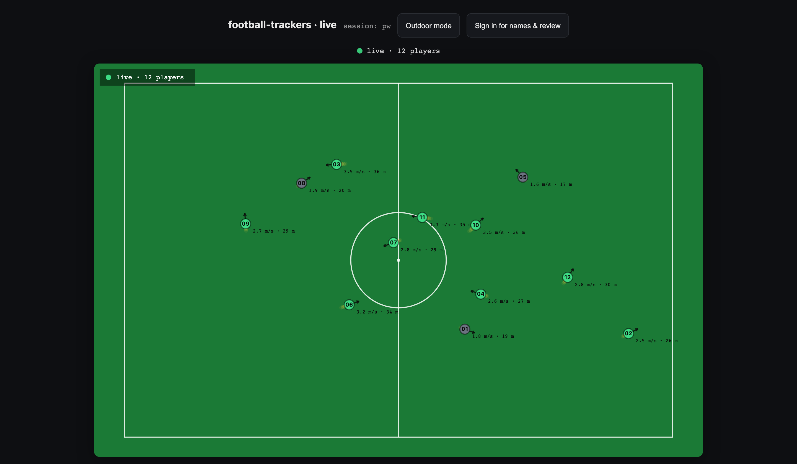
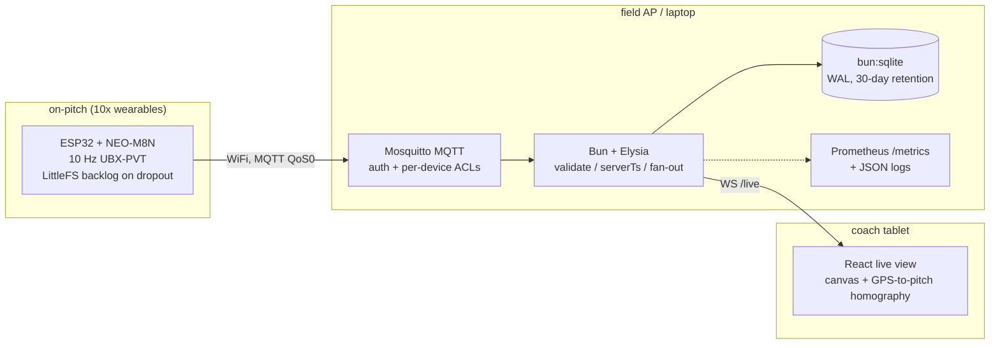

# football-trackers

Personal, open DIY system for **real-time** tracking of youth football players.
Each player wears a small ESP32 + GNSS device that streams position at 10 Hz over
WiFi to a local broker; a **Bun + Elysia** service ingests, server-stamps, and fans out to a
live coach view. A personal hobby project — fully self-contained, built end to end (hardware, firmware, backend, frontend, CV).

[](https://miloscvetkovicdev.github.io/football-trackers/)
[](https://github.com/milosCvetkovicDev/football-trackers/actions/workflows/server-ci.yml)
[](https://github.com/milosCvetkovicDev/football-trackers/actions/workflows/client-ci.yml)
[](https://github.com/milosCvetkovicDev/football-trackers/actions/workflows/firmware-ci.yml)
[](https://github.com/milosCvetkovicDev/football-trackers/actions/workflows/vision-ci.yml)
[](https://github.com/milosCvetkovicDev/football-trackers/actions/workflows/repo-guard.yml)
[](LICENSE)


*The coach live view rendering a 12-player simulated fleet at 10 Hz — captured from the hardware-free
e2e stack (`bun run sim --standalone`), which is also how every Playwright spec drives the real pipeline.*

## Architecture


MQTT topics:
- `football-trackers/session/{sessionId}/player/{playerId}/telemetry` — `{id, pl, ts, lat, lon, spd, hdg, fix, sats, pdop}`
- `football-trackers/session/{sessionId}/player/{playerId}/status` — device health (battery, RSSI, heap, backlog, fix), ~every 5 s

(`ts` = device millis, ordering only; `serverTs` is the authoritative timestamp.)
The server exposes Prometheus metrics on `/metrics` — see [observability](docs/architecture/observability.md).

## Run it in 60 seconds (no hardware)

Two terminals; needs [Bun](https://bun.sh) and `mosquitto` on `PATH` (`brew install mosquitto`).

```bash
cd server && bun install && bun run sim --standalone --players 10
```

```bash
cd client && bun install && VITE_PROXY_TARGET=http://127.0.0.1:3000 bun run dev
```

Open http://localhost:5173 — the screenshot above is exactly this: a spawned broker + the real
server + 10 virtual devices publishing the firmware's wire contract at 10 Hz. Fault injection,
load ramps, record/replay and a `--secure` auth mode are one flag away
([server/README.md](server/README.md)).

## How this is built

- **Decision discipline** — 25 cross-referenced [ADRs](docs/decisions/README.md) (context,
  alternatives, consequences, amendment chains) plus a frozen pre-code contract per frontend phase.
- **Test rigor** — one gate per part: 32 sequential server suites (~64 s) behind a runner that
  refuses to start if a test file is neither a declared suite nor a declared non-suite (the gate
  cannot silently shrink); client typecheck + lint + unit + Playwright e2e across five
  self-contained stacks (real broker, real server, simulated fleet — no mocks); a 177-test
  CPU-only vision suite; host-compiled firmware logic tests. All five run in CI on every push.
- **Privacy as mechanism, not policy** — pseudonymous ids on the wire and in the store, real names
  in one access-controlled file joined at render time only; per-player erasure that also rewrites
  every backup and proves it by re-count; 30-day retention; static posture guards that fail CI if
  the dev or production stack drifts (loopback binds, non-root images, authenticated broker).
- **Audited** — a [2026-08 production-readiness audit](docs/audit/2026-08-03-production-readiness.md)
  drove 8 hardening phases (graceful shutdown, schema migrations, verified backups, supply-chain
  pins), each closed by execution-verified acceptance criteria.
- **Validated on real hardware** — the assembled ESP32+NEO-M8N prototype streamed
  device -> Wi-Fi -> authenticated broker -> server -> live view end to end (2026-06-17).

The working method behind those habits — the agent configuration, the maker ≠ checker
review discipline, the PM ceremony that turns "done" into a machine-checkable claim — is
published separately as
[**claude-code-monorepo**](https://github.com/milosCvetkovicDev/claude-code-monorepo),
a 13-chapter book on the setup this project was built with.

## Why DIY
Commercial trackers are either cheap-but-closed (no real-time, no open data) or
have an API but cost a subscription per player. Goal here: real-time + fully owned.

## Docs

**Read them online:** <https://miloscvetkovicdev.github.io/football-trackers/> — all 52 documents
and 25 ADRs, searchable, with the subproject READMEs alongside them.

Product & business requirements live in [`docs/`](docs/README.md): [vision](docs/product/vision.md),
[market analysis](docs/product/market-analysis.md), [BRD](docs/requirements/business-requirements.md),
[functional](docs/requirements/functional-requirements.md) / [non-functional](docs/requirements/non-functional-requirements.md)
requirements, [metric definitions](docs/requirements/metric-definitions.md), [architecture](docs/architecture/system-architecture.md),
[observability](docs/architecture/observability.md), [hardware BOM](docs/architecture/hardware-bom.md),
and [decision records](docs/decisions/README.md).

## Repo layout
```
football-trackers/
  firmware/            ESP32 firmware (PlatformIO / Arduino)
    platformio.ini
    src/main.cpp
  server/              Bun + Elysia ingest + live fan-out (standalone app)
    src/
      types.ts         wire contract (RawTelemetry/Telemetry) + topic regex
      db.ts            bun:sqlite persistence
      ingest.ts        MQTT subscribe -> validate -> enrich -> persist + fan-out
      server.ts        Elysia entry: /live WS + /health, wires ingest
    test/              self-contained, hardware-free e2e (spawns broker+server)
  client/              Bun + Vite + React coach live view
    src/
      homography.ts    4-corner GPS->pitch projective transform (+ unit tests)
      useLiveTelemetry.ts  /live WS -> useRef Map (no per-packet re-render)
      PitchCanvas.tsx  rAF canvas render: pitch + player dots
  vision/              offline camera/CV analysis — SEPARATE subproject, Python, Docker-only
    footballcv/        decode -> detect+track -> team split -> annotate (v1 works end to end)
    webui/             paste a public YouTube link -> annotated video, behind a privacy gate
    test/              177 CPU tests; no torch, no weights, no network
  deploy/production/   the real deployment stack (non-root image, no anonymous access)
```

## Offline camera/CV analysis — `vision/`
A **separate, self-contained subproject** ([ADR-0023](docs/decisions/0023-camera-cv-offline-analysis.md),
[`vision/README.md`](vision/README.md)) that analyses *recorded* football video: detect + track players,
split them into two anchored teams, write an annotated video. It shares nothing with the tracker at
runtime — different language, different container, no network at inference time.

It exists because **Track B below needs sensing the GPS trackers do not have**, and a camera is one of
the two candidate routes. v1 is wired and verified end to end on public adult footage; `--ball`/`--radar`
(v2) and `--stats` over video (v3) are **not implemented and exit non-zero** rather than pretending.

> **The privacy gate is the point, not a formality.** This runs on **PUBLIC adult/professional footage
> ONLY** — never youth footage, in any phase, with or without a claim of parental consent. Pointing a
> camera at the children this project otherwise tracks is a *separate* gate needing a DPIA, verified
> consent and a documented lawful basis, deferred to a future ADR ([ADR-0023](docs/decisions/0023-camera-cv-offline-analysis.md) §2/§14).
> The gate is enforced server-side, every clip in `samples/` carries a provenance row, and the
> whole thing is loopback-only with a 24 h retention sweep.

```bash
cd vision
docker compose run --rm test       # the test suite (CPU image; runs on the Mac too)
docker compose up webui            # http://127.0.0.1:8077 — paste a public YouTube link
```

## Hardware (1 prototype, sourced in Serbia)
- MCU: WEMOS Lite ESP32 (LOLIN32 Lite) — onboard LiPo charging
- GNSS: GY-GPSV3 NEO-M8N (u-blox, up to 10 Hz)
- Battery: LP-503759CL Li-Po 3.7V 1350 mAh
- Jumper wires (F-F) + male 2.54 mm header strip
- Tools: micro-USB cable, soldering iron, multimeter (verify LiPo polarity!)

## Firmware
PlatformIO: `cd firmware && pio run -t upload && pio device monitor`.
**Secrets are NOT in source** — the WiFi PSK and this device's MQTT username (= `PLAYER_ID`) / password live in
NVS, set once over serial on first boot via the `enroll` console
([ADR-0014](docs/decisions/0014-firmware-secret-provisioning.md)), so the same image flashes to every device
and only NVS differs. Full build / enrollment / rotation / flash-encryption runbook:
[`firmware/README.md`](firmware/README.md).
Wiring (Serial2): M8N TX -> GPIO16, M8N RX -> GPIO17, plus 3V3 + GND. First fix: outdoors, 30-60 s cold start.

## Server
Bun + Elysia, standalone (no build step). The MQTT ingest runs alongside the Elysia HTTP/WS server
in one process and fans out over native WS pub/sub. **Full detail — every env knob, the auth model,
the suite-by-suite test map, the data-lifecycle CLIs and the simulator's whole flag set — lives in
[`server/README.md`](server/README.md).**
```
cd server && bun install
bun start          # PORT=3000, MQTT_URL, DB_PATH env — see server/README.md
bun run test       # THE GATE: all 32 suites, sequential, ~64 s (test/run-all.ts)
```
Auth (Phase 2): named login (argon2id) -> HttpOnly cookie -> same-origin `/live` upgrade; the
principal is authorised against the requested session server-side
([ADR-0015](docs/decisions/0015-frontend-auth-transport.md),
[ADR-0008](docs/decisions/0008-authentication-access-control.md)). Provision a coach:
`bun run auth-user.ts add coach --role coach --sessions test`.

Quick end-to-end test (no hardware) — start a broker + the server, then:
```
mosquitto_pub -t 'football-trackers/session/test/player/01/telemetry' \
  -m '{"id":"trk-01","pl":"01","ts":1,"lat":44.8297,"lon":20.4007,"spd":3.2,"hdg":90,"fix":3,"sats":11,"pdop":1.2}'
```
Connect a WS client to `/live?sessionId=test` and watch for `{event:"telemetry"}` frames — or skip
the broker entirely and run the simulator.

### Simulate a device fleet (no hardware)
[`test/simulate.ts`](server/test/simulate.ts) is a virtual fleet: N MQTT clients publishing the
**exact** firmware wire contract (10 Hz telemetry + 5 s status) with believable movement, plus
fault injection (bad fixes / out-of-range / id-mismatch / rate bursts / dropout -> backlog ->
replay), load ramps with per-stage p99 reports, deterministic `--record`/`--replay`, and a
`--secure` mode that provisions per-player broker ACLs + a real coach login. Turnkey:
```
cd server && bun run sim --standalone --players 10
```
Erase one player's raw location (GDPR / lost device): `bun run purge-player.ts <playerId>` — erases
the live store **and every backup**, and proves it by re-count
([ADR-0010](docs/decisions/0010-location-data-retention.md)).

## Client (coach live view)
Bun + Vite + React. Connects a plain WebSocket to `/live?sessionId=...`, keeps the
latest fix per player in a `useRef` Map, and renders dots on a `<canvas>` via
`requestAnimationFrame`. GPS->pitch is a homography from the 4 corner coords. Phase 1 hardening
(see [docs/frontend/improvement-plan.md](docs/frontend/improvement-plan.md)) adds a DPR-crisp,
~30fps-capped canvas; an honest bounded-interpolation motion model ([ADR-0018](docs/decisions/0018-live-position-smoothing-honesty.md):
snap across gaps, never extrapolate); explicit connection failure states (no silent infinite
reconnect); an accessible DOM mirror + ARIA live region; a strict CSP; and an outdoor high-contrast
mode + screen wake-lock.
```
cd client && bun install
bun run dev        # http://localhost:5173 ; same-origin via Vite proxy: VITE_PROXY_TARGET (default http://localhost:3000), VITE_DEFAULT_SESSION (default test)
bun run typecheck  # tsc --noEmit
bun run lint       # eslint (flat config, react-hooks)
bun test           # unit: homography + interpolation honesty + inbound-WS-frame validation
bun run e2e        # Playwright smoke + a11y + explicit-failure-state, driven by the simulator (first: bunx playwright install chromium)
bun run e2e:frame-budget   # 50-player frame-budget + DPR-crisp gate (verified separately)
```
Set your pitch's four GPS corners in `src/config.ts`. The app now opens with a **login screen**
([ADR-0015](docs/decisions/0015-frontend-auth-transport.md)): sign in with a coach/admin account, then it
connects to `/live` **same-origin** so the session cookie rides the upgrade — Vite proxies `/live`, `/auth`, and
`/sessions` to `VITE_PROXY_TARGET`, so no `VITE_LIVE_TOKEN`/`VITE_WS_URL` (both removed) and no per-client WS URL.
Add this app's origin (`http://localhost:5173`) to the server's `ALLOWED_ORIGINS`, and in dev set the server's
`AUTH_COOKIE_SECURE=false` (reach it via `http://localhost`, a secure context). With the server running and a
coach signed in, a `mosquitto_pub` of the README packet renders a dot at pitch centre. The CSP is
`connect-src 'self'` (same-origin WS + fetch + HMR) — no host to configure.

## Local dev with Docker Compose (+ bench-testing a real wearable)
One command brings up the device-facing backend (MQTT broker + ingest/WS server); the coach view (Vite) runs on
the host. Full walkthrough + troubleshooting: [docs/dev/local-bench-runbook.md](docs/dev/local-bench-runbook.md)
([ADR-0021](docs/decisions/0021-local-dev-docker-stack.md)).
```
./server/mosquitto/dev-provision.sh 01   # ONCE: broker accounts + .env (ft.passwd is gitignored)
docker compose up -d                     # broker (1883, authenticated) + server (127.0.0.1:3007)
cd client && VITE_PROXY_TARGET=http://127.0.0.1:3007 bun run dev   # coach view -> http://localhost:5173
```
- A real wearable connects to **this Mac's Wi-Fi IP** on 1883 — set the firmware `MQTT_HOST` to it; the device and
  the Mac must be on the **same Wi-Fi** (a wired dock Ethernet was found to be isolated from the Wi-Fi).
- The coach view runs on the **host**, not in the stack — Vite's `/live` WebSocket proxy doesn't relay the upgrade
  from a container.
- **The broker is authenticated** — it mounts the same `allow_anonymous false` config + per-device ACLs the field
  broker uses, so `docker compose up` fails loudly until `dev-provision.sh` has created the accounts, and every
  bench run exercises the real auth path. Re-running provisioning rotates credentials; follow it with
  `docker compose up -d`, because `restart` does not re-read `.env`.
- **The server is published on `127.0.0.1` only.** It runs in anon live mode (no login for the pitch view), and a
  no-login feed of children's positions must not also be reachable from the Wi-Fi. That makes the coach view
  this-machine-only; a pitch-side tablet is the Caddy + real-auth deployment, not this stack. Use
  `http://127.0.0.1:3007` (not `localhost`) as the proxy target — the bind is IPv4-only.
- **Names and Review still need a real login here.** `/roster`, `/history` and `/events` answer 403
  `login_required` for the anonymous principal; the anon view shows pseudonymous ids and a "Sign in for names &
  review" button. Provision a coach with
  `cd server && AUTH_ACCOUNTS_FILE=./auth-accounts.json bun run auth-user.ts add coach --role coach --sessions test`.

## Status / next
- [x] Hardware ordered (1-2 prototype sets)
- [x] Firmware skeleton (10 Hz -> MQTT, LittleFS backlog on dropout); **hardened in audit Phase 4** (2026-08-24): non-blocking reconnect + jittered backoff + 8 KB GPS buffer (an outage no longer starves the drain), crash-safe paced replay (NVS cursor + `sq` dedupe server-side), GPS-UTC `gts` so replays keep their real timestamps, watchdog + reset-reason/boot-count/version in `.../status`, id validation at enrollment, NVS `session_id`, backlog age purge + `wipe` — bench acceptance run pending (see the runbook §7)
- [x] Bun/Elysia ingest + WS fan-out + bun:sqlite persist (e2e verified, no hardware)
- [x] Observability: Prometheus `/metrics`, JSON logs, device `.../status` health topic (e2e verified)
- [x] Security MSI: token-gated `/live` (+ Origin/CSWSH check), per-device MQTT creds + topic ACLs, server-side `id_mismatch` reject (e2e verified). Architecture-board reviewed — see [target-architecture](docs/architecture/target-architecture.md) + [ADRs 0006–0014](docs/decisions/README.md)
- [x] Data minimisation ([ADR-0010](docs/decisions/0010-location-data-retention.md)): 30-day raw-fix auto-purge (batched) that also prunes roster sessions whose fixes are gone, per-player erasure CLI (indexed + batched delete, `secure_delete` + forced WAL `TRUNCATE` checkpoint, permissive roster rewrite, distinct exit codes), self-reporting retention metrics — the five ways erasure was broken are pinned by `test/erasure-audit.ts` (audit 2026-08-03 §4.5, Phase 2b)
- [x] React live view: 4-corner pitch homography, useRef Map + rAF canvas (browser-verified, no hardware)
- [x] FE Phase 1 (client-only MSI): DPR-crisp/~30fps-capped canvas, honest bounded interpolation ([ADR-0018](docs/decisions/0018-live-position-smoothing-honesty.md)), explicit failure states, accessible mirror + ARIA, strict CSP (`connect-src` was derived from a bundled WS URL then; Phase 2 replaced it with `'self'` over the same-origin proxy), outdoor mode + wake-lock — typecheck/lint/unit + Playwright e2e through the simulator (p95 9.4 ms @ 50 players, DPR-crisp verified). See [improvement-plan](docs/frontend/improvement-plan.md)
- [x] FE Phase 2 (auth & security core): named login (argon2id + HttpOnly cookie) -> **cookie-on-upgrade**; bundled `LIVE_TOKEN` killed; principal-bound session authz on `/live` (`ft_ws_rejected{reason="not_authorized_for_session"}`); accounts file + `auth-user.ts` CLI; Vite same-origin proxy + `connect-src 'self'`; strict Origin; isolated-LAN anon scoped to `ANON_SESSIONS` ([ADR-0015](docs/decisions/0015-frontend-auth-transport.md), implements [ADR-0008](docs/decisions/0008-authentication-access-control.md)) — verified by the server auth e2e + client Playwright auth specs through the simulator
- [x] FE Phase 3 (identity, health, review): per-session roster **names** via authenticated `GET /sessions/:id/roster` (`roster-user.ts` CLI + `roster.json`, render-only client join, erasure-coupled in `purge-player`) ([ADR-0016](docs/decisions/0016-player-name-roster.md)); per-player **device health** as a second `/live` envelope (`{event:'status'}`) from the `.../status` topic; **review/replay** via off-loop/paged `GET /sessions/:id/history` (aggregate + heatmap default, raw scrub on demand) ([ADR-0017](docs/decisions/0017-review-replay-data-source.md)) — names never reach the store/DB/metrics/logs/client-persistence; verified by the Phase-3 server tests + Playwright live/review specs. See [improvement-plan](docs/frontend/improvement-plan.md)
- [x] Tactical event detection — **Track A** ([ADR-0020](docs/decisions/0020-tactical-event-detection.md), [contract](docs/frontend/event-detection-contract.md)): off-loop `GET /sessions/:id/events` — a bucketed team-shape series (centroid/compactness/hull) + heuristic **high-tempo / transition / stoppage** phases, rendered as a review-mode timeline; team-aggregate (no name/playerId, ever), honesty-labelled (confidence + provenance), the inflight cap **shared** with `/history`. Movement-derived, **not** confirmed ball events. Built frozen-contract → 5-lens pre-mortem (6 must-fix folded) → parallel slices → post-build review; verified by `test/events.ts` + `test/events-e2e.ts` (270k-row off-loop SLO + shared-cap 503) + the Playwright review spec
- [x] Validate full pipeline on ONE device (2026-06-17): real ESP32+NEO-M8N assembled → flashed → enrolled → **device → Wi-Fi → broker → server → live view** all confirmed end-to-end (server received the device's `.../status` health + 10 Hz telemetry; indoors all positions correctly dropped `no_fix`, a synthetic `fix=3` packet rendered a dot). Local Docker stack + the bench runbook: [docs/dev/local-bench-runbook.md](docs/dev/local-bench-runbook.md). **Remaining:** the outdoor real-GPS dot + the LiPo battery (untethered field use)
- [x] Coach-view reliability (**audit Phase 5**, 2026-08-26): server-clock skew correction (`serverClock.ts` — a match-day LAN has no NTP, and a 10 s-fast tablet used to render an EMPTY pitch over a healthy feed); a recoverable reconnect give-up ("Reconnect now" + an `online` listener, so a dead feed is no longer dead for the match); the pitch's four GPS corners moved out of the bundle into per-session config (`session-config.ts set-pitch`, validated on both sides so a degenerate quad can't white-screen the view); scoped error boundaries (a Review crash no longer takes the whole page); a deadline on every fetch + retries that actually re-fetch; off-pitch players pinned to the canvas edge instead of silently clipped; 44 px touch targets; and a minimal client beacon (`ft_client_events_total{kind}`) so a dark tablet is finally visible from `/metrics`. Verified by the new client unit suites + the Playwright `reliability` project (a real server kill/restart, a 30 s-skewed browser clock, an induced Review crash) + `test/beacon-e2e.ts`
- [x] Operability (**audit Phase 6**, 2026-08-27, [ADR-0025](docs/decisions/0025-operability-lifecycle.md)): `docker stop` went from **exit 137 (SIGKILL) in 1.3 s** to **exit 0 in ~0.2 s** — an ordered teardown (drain → abort scans → broker → listeners → hand over sessions → checkpoint) on a process that can finally receive the signal (`exec` + `init: true`), with a hard deadline so a wedged step cannot hand the kill back to Docker; `uncaughtException` exits 1 through the same path, `unhandledRejection` is counted and does not; a `PRAGMA user_version` migration ladder that **refuses to start** against a store newer than the build; verified `VACUUM INTO` backups whose rotation is bounded by **both** `BACKUP_KEEP` and `RETENTION_DAYS` — and which `purge-player.ts` now erases from, per file, with a proof-by-recount (a backup is a complete copy of children's location); a compose healthcheck on `/health` (broker down → unhealthy in 45 s, back in 10) plus capped logs; server-side scan cancellation (`request.signal` + a 25 s budget — the item Phase 5 deferred); `mode: 0o600` that is no longer a no-op on an existing file; WS fan-out drops counted as drops rather than sends; coaches staying logged in across a restart (a 0600 file of `sha256(token)` verifiers, consumed on read); and a real production stack — [`deploy/production/`](deploy/production/README.md), non-root image with no roster/accounts/store in any layer, no anonymous access, nothing on `0.0.0.0`, guarded by 37 static checks in `test/deploy-posture.ts`. TLS for the field box is the one piece deliberately left open (it needs an internal-CA decision, not a guessed Caddyfile)
- [ ] Persistence at scale: TimescaleDB hypertable (sqlite is fine for now)
- [ ] Football events — **Track B** (passes/shots/tackles): **not** derivable from GPS one-team positions — needs a calf IMU @200-500 Hz + ML, or one elevated 4K camera + CV. Scoped but deferred in [ADR-0020](docs/decisions/0020-tactical-event-detection.md) §6. **The camera route is part-built**: [`vision/`](vision/README.md) ([ADR-0023](docs/decisions/0023-camera-cv-offline-analysis.md)) detects + tracks players and splits teams on *public adult* footage today (v1, verified end to end 2026-06-20; v2 ball/radar and v3 analytics-over-video are **not** implemented and refuse rather than no-op). What blocks it for THIS project is unchanged and is not an engineering problem: pointing it at the children needs the DPIA / consent / lawful-basis gate ADR-0023 §14 defers

## Contributing & security

A personal project — issues are welcome, PRs by prior discussion, and anything exploitable goes
through [SECURITY.md](SECURITY.md) (private reporting, please). Licensed [MIT](LICENSE).
